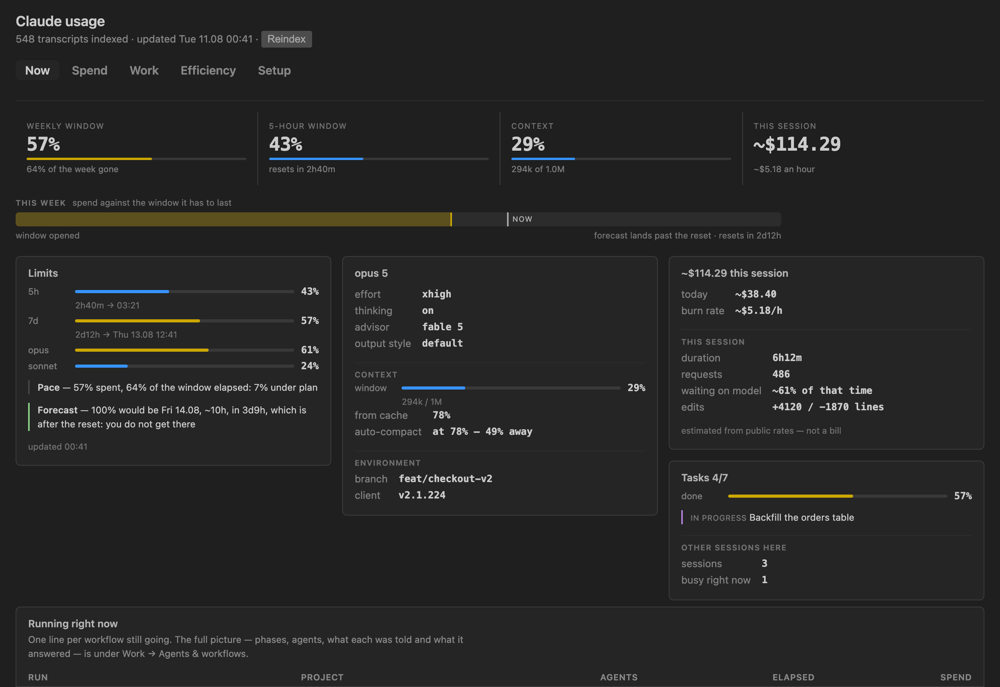
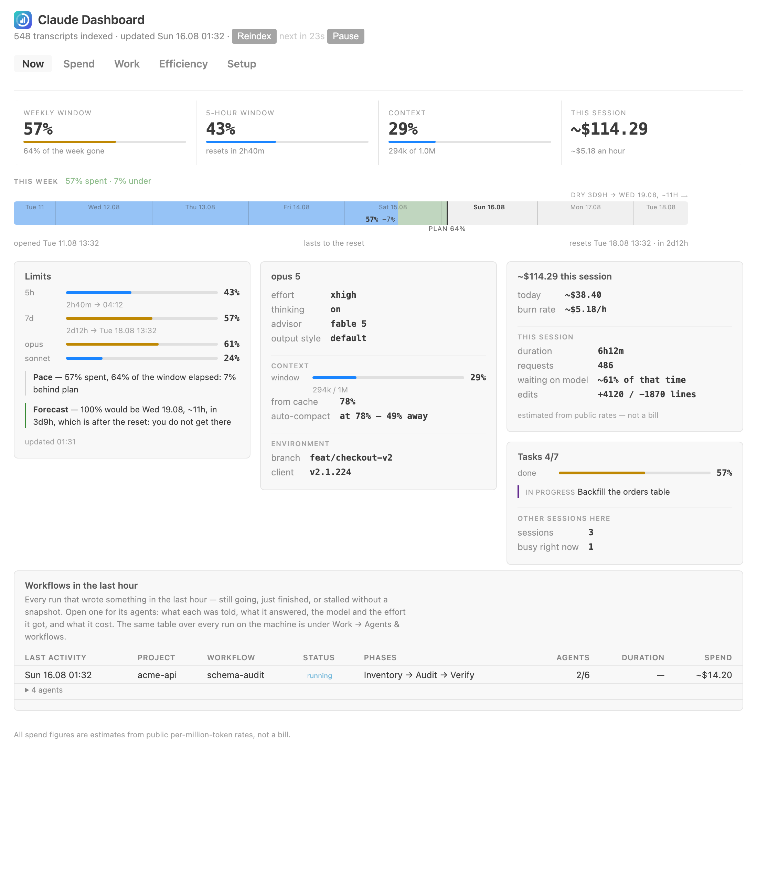
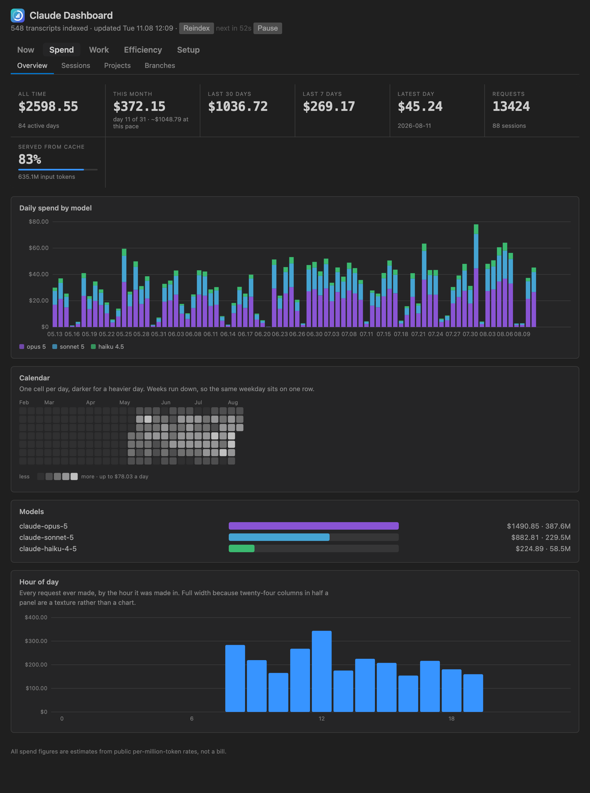
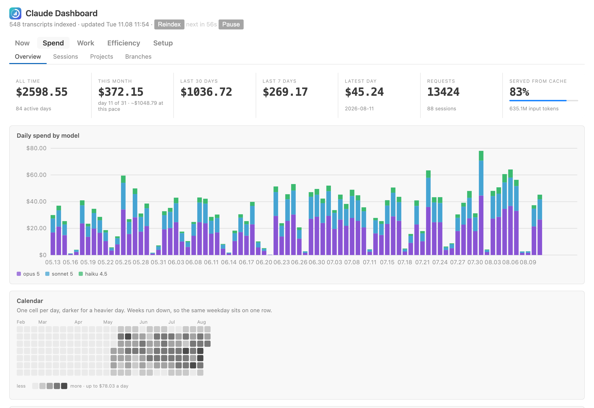
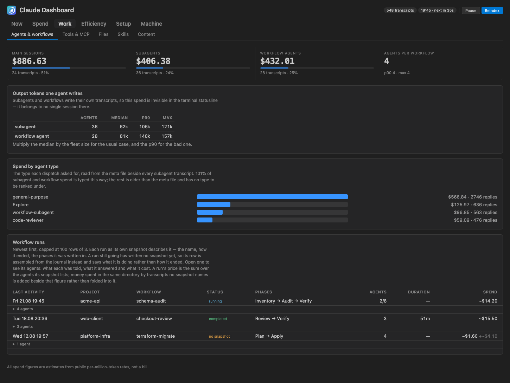
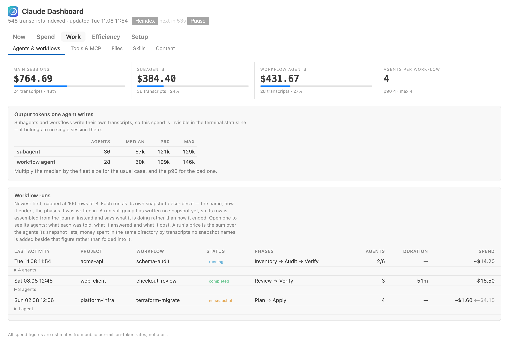
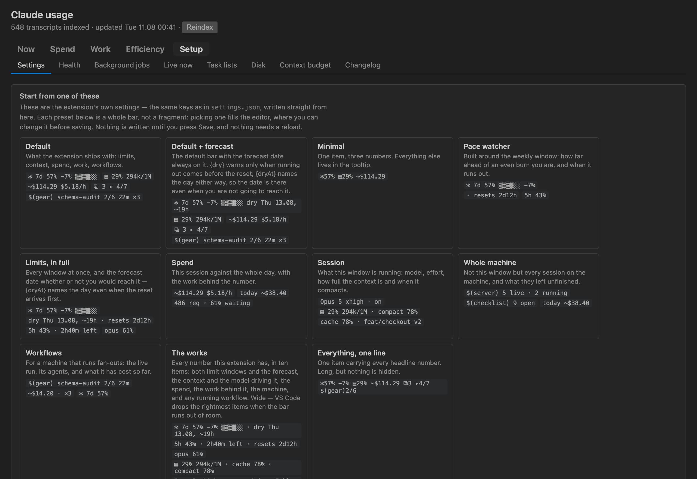
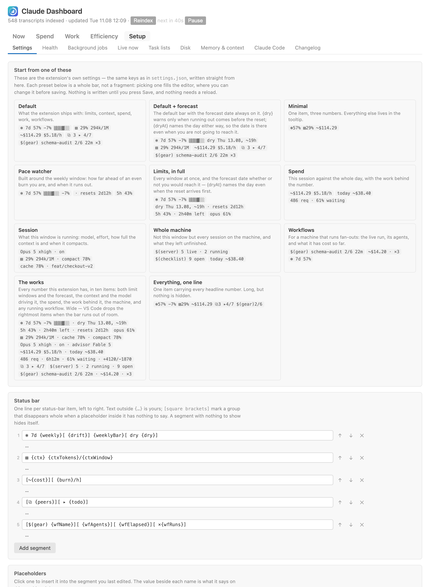
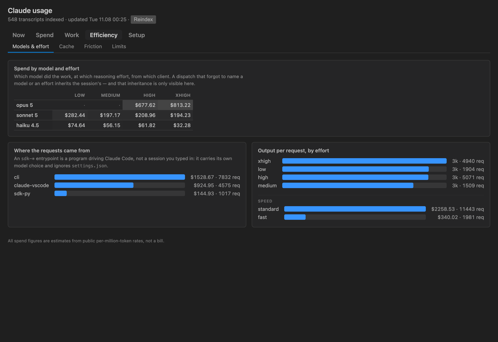

<p align="center">
  
</p>

<h1 align="center">Dashboard &amp; Statusline for Claude Code</h1>

<p align="center">
  <b>Two things in one extension.</b><br/>
  A <b>dashboard</b> over every Claude Code transcript on the machine — spend, agents, workflows, limits, friction —<br/>
  and a <b>status bar</b> you write yourself, for the four numbers you want in front of you all day.
</p>

<p align="center">
  <a href="https://marketplace.visualstudio.com/items?itemName=grgrwlkr.claude-dashboard"></a>
  <!-- installs and rating wait for real data: with no statistics yet the badge
       services do not go blank, they print the upstream error code as the value
       — "installs 500" reads as five hundred installs. Paste back once the first
       ones land:
  <a href="https://marketplace.visualstudio.com/items?itemName=grgrwlkr.claude-dashboard"></a>
  <a href="https://marketplace.visualstudio.com/items?itemName=grgrwlkr.claude-dashboard&ssr=false#review-details"></a>
  -->
  <a href="https://open-vsx.org/extension/grgrwlkr/claude-dashboard"></a>
  <a href="https://github.com/grgrwlkr/claude-dashboard-vscode"></a>
  <a href="LICENSE"></a>
</p>

<p align="center">
  <a href="#user-content-what-you-get"><b>Features</b></a> ·
  <a href="#user-content-dark-and-light"><b>Screenshots</b></a> ·
  <a href="#user-content-install"><b>Install</b></a> ·
  <a href="#user-content-configuring-the-bar"><b>Configure the bar</b></a> ·
  <a href="#user-content-the-dashboard"><b>Dashboard</b></a> ·
  <a href="#user-content-workflow-runs"><b>Workflows</b></a>
  <br/>
  <a href="#user-content-privacy"><b>Privacy</b></a> ·
  <a href="#user-content-settings-and-commands"><b>Settings</b></a> ·
  <a href="#user-content-where-the-data-comes-from"><b>Data sources</b></a> ·
  <a href="#user-content-known-issues-and-limits"><b>Known issues</b></a> ·
  <a href="#user-content-contributing"><b>Contributing</b></a> ·
  <a href="https://github.com/grgrwlkr/claude-dashboard-vscode/issues"><b>Report a bug</b></a>
</p>

> ⚠️ **Unofficial.** Not affiliated with, endorsed by or sponsored by Anthropic, PBC.
> "Claude" and "Claude Code" are their trademarks; this extension only reads what
> the tool already leaves on your own disk.

```text
✻ 7d 27% ██░░░░ dry 12.08 ~13h    ▤ 29% 294k/1M    ~$114.29 $5.18/h    ⧉ 2 ▸ 3/6
```

Claude Code writes a great deal to disk and shows you almost none of it. Its VS
Code panel has no status line at all — the `statusLine` command from
`~/.claude/settings.json` is never run, and the upstream requests for parity with
the CLI were closed as stale
([#55643](https://github.com/anthropics/claude-code/issues/55643),
[#21265](https://github.com/anthropics/claude-code/issues/21265)) — and nothing
anywhere adds up what your subagents and workflow runs actually cost, which on a
machine that uses them is the larger half of the bill.

This extension reads that state and gives it two surfaces: **a status bar you
write yourself**, and **a dashboard** over every transcript on the machine.



<a name="what-you-get"></a><a name="user-content-what-you-get"></a>

## ✨ What you get

|  |  |
| --- | --- |
| **📉 Never hit the wall by surprise** | The weekly and 5-hour windows with a pace bar: `█` is spend, `▓` is spend ahead of an even burn, `▒` is plan you have not reached yet. `dry` says when you hit 100 % if the pace holds — and stays quiet when that lands after the reset, because running out then never happens. |
| **🧠 The context of *this* window** | How full the model's window is for the Claude session open in this VS Code window — not "the newest session on the machine". Hover for model, effort, thinking, advisor, cache share, auto-compact distance, branch and client version. |
| **💸 What it actually costs** | Session spend with a burn rate, today across every project, and a dashboard that breaks it down by day, model, project, branch, tool and skill. Estimated from public rates — the one figure that is real money, usage credits, is labelled as such. |
| **🤖 The agents nobody else shows** | Subagents and workflow agents write their own transcripts, so on a machine that runs fan-outs their spend is the larger half — and it is invisible in the terminal statusline, which only ever sees one session. Here they get a tree, a table and a live row each. |
| **🎛️ A bar you write yourself** | The bar is a template, not a layout: 45 placeholders, optional groups that vanish when empty, 11 ready-made bars, and an editor with a live preview. |
| **🔒 Local by default** | Everything is read from your own disk. One request leaves the machine — the limits, and it has a switch — plus two opt-ins that are off until you turn them on. No telemetry, ever. See [Privacy](#user-content-privacy). |

<a name="dark-and-light"></a><a name="user-content-dark-and-light"></a>

## 🌗 Dark and light

The page is drawn entirely from `--vscode-*` theme variables, so it follows the
editor rather than fighting it.

| Dark Modern | Light Modern |
| --- | --- |
|  |  |
|  |  |
|  |  |
|  |  |

<a name="install"></a><a name="user-content-install"></a>

## 🚀 Install

From the [Visual Studio Marketplace](https://marketplace.visualstudio.com/items?itemName=grgrwlkr.claude-dashboard),
or from [Open VSX](https://open-vsx.org/extension/grgrwlkr/claude-dashboard) for
Cursor, Windsurf, VSCodium and Gitpod:

```bash
code --install-extension grgrwlkr.claude-dashboard
```

From source, which is also how you develop on it:

```bash
npx @vscode/vsce package
code --install-extension claude-dashboard-*.vsix
```

Then reload the window (`Cmd+Shift+P` → Reload Window) — VS Code keeps the old
code in the extension host until you do.

**Nothing appeared in the status bar?** That is the design rather than a failure:
every item hides itself when it has nothing true to say. It has nothing to say
when Claude Code has never run on this machine (no `~/.claude`), when no Claude
session belongs to *this* window yet — open the Claude Code panel and it appears
within ten seconds — or when limits are switched off and no cache exists. The
dashboard works either way: **Claude: Open dashboard**.

### Requirements

- **Claude Code** installed and used on this machine — the extension reads its
  state and asks nothing of the CLI.
- **VS Code 1.100** or newer.
- **macOS or Linux.** Windows is not supported: the token lives behind the macOS
  Keychain or in the credentials file, and session ownership is resolved with
  POSIX `ps`. On Windows the extension degrades quietly — items stay hidden
  rather than showing wrong numbers — but that is tolerance, not support.

<a name="configuring-the-bar"></a><a name="user-content-configuring-the-bar"></a>

## 🎛️ Configuring the bar

The five items above are just the default value of `claudeStatusline.segments`.
One string is one status-bar item, left to right:

```jsonc
"claudeStatusline.segments": [
  "✻ 7d {weekly}[ {drift}] {weeklyBar}[ dry {dry}]",
  "▤ {ctx} {ctxTokens}/{ctxWindow}",
  "[~{cost}][ {burn}/h]",
  "[⧉ {peers}][ ▸ {todo}]",
  "[$(gear) {wfName}][ {wfAgents}][ {wfElapsed}][ ×{wfRuns}]"
]
```

Anything outside `{…}` is literal, so the icons and separators are yours to
choose — including VS Code's own `$(flame)` codicons. Square brackets mark an
**optional group**: it disappears whole when a placeholder inside it has nothing
to say, which is how `[ dry {dry}]` stays silent for the first half hour of a
window and appears by itself once a forecast exists. A segment whose placeholders
are *all* empty hides itself — which is the whole of the last line above: every
part of it is optional, so it stays invisible until a workflow starts. A segment
of pure text always shows. A backslash escapes `{`, `}`, `[` and `]`.

**Setup → Settings** in the dashboard is an editor for exactly this: a field per
segment, a preview under each one rendered by the extension itself, buttons to
reorder and remove, and a palette of every placeholder with the value it has this
minute — clicking one inserts it at the caret.


It opens with eleven ready-made bars, each shown with what it would say on this
machine right now — **Default**, **Default + forecast**, **Minimal**, **Pace
watcher**, **Limits, in full**, **Spend**, **Session**, **Whole machine**,
**Workflows**, **The works** and **Everything, one line**. Picking one fills the
editor; nothing is written until you press Save.

The rest of the tab is every other setting this extension has, grouped: what is
read and what leaves the machine, **Starting a session** — where **Open Claude
Code** puts it and what it runs there — and the behaviour of the bar itself. Save
is a bar of its own at the foot of the tab rather than a button inside one of
those panels, and it says whether there is anything to save: inert until
something is edited, lit and marked **unsaved changes** once it is, and back to
inert if the edit is undone by hand.

Two placeholders answer "when do I run out", and the difference matters: `{dry}`
is silent when the forecast lands after the reset — running out then never
happens — while `{dryAt}` names the date either way.

<details>
<summary><b>All 45 placeholders</b></summary>

| Group | Placeholders |
| --- | --- |
| Limits | `{weekly}` `{weeklyBar}` `{plan}` `{drift}` `{dry}` `{dryAt}` `{dryLeft}` `{reset}` `{resetLeft}` `{session5h}` `{session5hLeft}` `{scoped}` `{scoped:Opus}` |
| Session | `{ctx}` `{ctxTokens}` `{ctxWindow}` `{ctxCache}` `{compact}` `{model}` `{effort}` `{advisor}` `{thinking}` `{outputStyle}` `{branch}` `{version}` `{update}` |
| Spend | `{cost}` `{burn}` `{today}` `{requests}` `{duration}` `{apiShare}` `{added}` `{removed}` |
| Work | `{peers}` `{peersBusy}` `{todo}` `{todoActive}` `{jobs}` `{sessions}` `{openTasks}` |
| Workflow | `{wfName}` `{wfAgents}` `{wfElapsed}` `{wfCost}` `{wfRuns}` |

A few worked examples:

```jsonc
// One dense item instead of four
["✻{weekly} ▤{ctx} ~{cost}[ ⧉{peers}]"]

// Pace and per-model windows, which the default bar leaves to the tooltip
["7d {weekly} ({drift})[ · opus {scoped:Opus}]", "resets {resetLeft}"]

// Machine-wide rather than session-scoped
["$(server) {sessions}[ · {jobs} running][ · {openTasks} open]", "today ~{today}"]
```

Outside the dashboard, **Claude Statusline: List status-bar placeholders** shows
the same list in a quick pick and copies whichever you choose.

</details>

Tooltips are not configurable and do not need to be: each segment gets the full
tooltip of every topic it mentions, so hiding a number from the bar never hides
it from the hover. Colour follows the same rule — a segment carrying a limit or a
context fill turns yellow past 50 % and red past 80 %. Reading is lazy: a field no
segment mentions is never collected, so a bar without `{today}` does not pay for
the walk across every project it needs.

<a name="the-dashboard"></a><a name="user-content-the-dashboard"></a>

## 📊 The dashboard

Click any status-bar item, or run **Claude: Open dashboard**. Twenty-three tabs in
five sections: one for the state of Claude right now, three drawn from an index of
every transcript on the machine, and one that reads the installation itself.

Every tab is built the same way: a strip of headline figures, then one panel per
answer. A figure that is a share of something is drawn as one rather than only
written.

**⏱️ Now** — the state of Claude as the page was opened: the four numbers that
decide the next hour as headline tiles, the week as a track of time — how long
the quota still lasts and how long the week runs on without it — the four
status-bar tooltips at full width, and a row
per agent of every workflow still running. Those panels are not a copy of the
tooltips: both are rendered from the same sections in `status.js`, so the page
cannot fall behind the hover.

<details>
<summary><b>💸 Spend</b> — where the money went</summary>

| Tab | What it answers |
| --- | --- |
| Overview | spend all-time / 30d / 7d / today, daily stacked chart by model, a calendar heatmap, model breakdown — a model whose rate is not published carries a tilde and says so on hover — hour-of-day profile |
| Sessions | every transcript as a row: its own title, project, kind, entrypoint, models and effort, duration, how much of that duration was actually work, requests, tokens, spend — and above the table, the most sessions that ever ran at once |
| Projects | which repository the money went to |
| Branches | spend per git branch, accumulated across sessions |

</details>

<details>
<summary><b>🤖 Work</b> — what it was spent on</summary>

| Tab | What it answers |
| --- | --- |
| Agents & workflows | main vs subagent vs workflow spend, spend by the agent type a dispatch asked for, what one agent costs (median, p90, max output tokens), agents per workflow run, and every run on the machine — its name, how it ended, its phases and its spend, with the prompt and the answer of each of its agents one click away |
| Tools & MCP | which tools were called and how often, which of them fail, which MCP servers earn their place in the config, how many advisor consultations there were |
| Files | every file an edit or write touched, by edit count and by lines changed |
| Skills | which skill was driving when the tokens burned, from the transcript's own `attributionSkill` |
| Content | prompt counts, length histogram, where prompts came from, and the words you use |

</details>

<details>
<summary><b>⚡ Efficiency</b> — whether it was spent well</summary>

| Tab | What it answers |
| --- | --- |
| Models & effort | spend as a model × effort matrix, which client the requests came from (`cli`, `claude-vscode`, `sdk-py`), output per request per tier |
| Cache | share served from cache, what the reads saved, reads per token written, the 1h/5m TTL split, and the replies the cache could not answer — calls that sent more than 100k of input at the full rate, largest first |
| Friction | failed tool calls, denials, compactions and the context they dropped, sessions with the most failures |
| Limits | the weekly window over time, one line per week, overlaid against the even-spend diagonal |



</details>

<details>
<summary><b>🔧 Setup</b> — the installation rather than its usage</summary>

| Tab | What it answers |
| --- | --- |
| Settings | the extension's own settings, edited here rather than in `settings.json` |
| Health | settings as they resolve, MCP servers, plugins and what each ships — each marked used or idle by whether anything of it appears in the transcripts — hooks, permission rules |
| Background jobs | every background agent: state, tokens burned, the session it holds, and the scratch directory it never cleaned up |
| Live now | sessions whose process is alive, editors attached, daemon workers — and registry entries left by sessions that crashed |
| Task lists | todo lists left behind by sessions, and what is still open in them |
| Disk | every directory under `~/.claude` by size, with the leftovers named |
| Memory & context | the files loaded into every prompt — `CLAUDE.md`, `rules/`, project memory — sized in tokens and priced across every request made |
| Claude Code | what you have set, what you could set, and what you moved away from the default — settings files in the order the client resolves them, with the file that won each key named and the ones it shadowed counted |
| Changelog | the client's own changelog, cut at the version currently running |

Nothing in this section writes to `~/.claude`, and there is no delete button
anywhere in it: the numbers are the point, the decision is yours.

</details>

**Indexing.** The first run reads every transcript — about 1.1 GB and 4–5 s on the
machine this was built on — behind a progress notification. After that a file
whose size and mtime are unchanged is reused as-is, so a refresh costs tens of
milliseconds. Only a fraction of the lines are parsed: a line is JSON-decoded only
if it carries a marker that matters. The index lives in the extension's own
storage, holds only aggregates, and never stores prompt text.

<a name="workflow-runs"></a><a name="user-content-workflow-runs"></a>

## 🧵 Workflow runs

The `/workflows` progress tree lives in the terminal and dies with it. What
survives is on disk, and this extension reads it into three surfaces: a **Workflow
runs** tree in the Activity Bar (run → phase → agent), the runs table on the
dashboard, and the placeholders above.

That tree is the last of four sections in the **Claude Dashboard** container.
Above it sit **Limits** — the 5-hour window above the weekly one, how far ahead
or behind plan the spend is, and when the window would run out at this rate;
**Session** — the model, the context window and what the session open in this
window has cost, hidden entirely when there is no session here; and **Live
sessions**, every session on the machine whose process is alive, named by its
project. The first two are the status bar's own tooltip sections, so the panel
and the hover cannot disagree. The icon carries a badge with the number of live
sessions, and no badge at all when nothing is running.

A run is in one of three states — **running** (no final snapshot, the owning
session is alive, the directory moved in the last ten minutes), **finished** (the
client wrote its one snapshot), and **abandoned** (everything else). The third is
not theoretical: the snapshot is written once, at the end, so a client that dies
never writes one, and without that state such a run would spin in the panel
forever.

**Money comes from `usage` records only** — from the index for an agent that has
stopped, straight from the transcript for one still writing. The totals a snapshot
carries are never turned into dollars: they are context sizes, not spend, and on
this machine the two are about thirty times apart.

Right-click a run to open the workflow script it was launched from, or to copy its
`runId` together with that path — what `resumeFromRunId` needs to replay a stage
that failed. There is deliberately no way to kill a run from here: the panel
observes, and a click that ends somebody else's live session is not worth having.

<a name="privacy"></a><a name="user-content-privacy"></a>

## 🔒 Privacy

Everything on the dashboard and in the bar is read from your own disk. **One
request can leave the machine, and it is optional.**

| | |
| --- | --- |
| **What is read locally** | `~/.claude` — transcripts, the session registry, settings, plugins, workflow runs. Read-only: nothing of ours is ever written there. |
| **What is written** | Only inside the extension's own storage: the aggregate index and the limit history. Neither holds prompt text. |
| **What leaves the machine** | One `GET https://api.anthropic.com/api/oauth/usage` — the same endpoint Claude Code's own `/usage` screen reads — carrying the OAuth token Claude Code already stores. At most once a minute per machine, however many windows are open — and shared with a terminal `statusline.sh` through the same cache file if you run one. |
| **What happens to the token** | Read from the macOS Keychain (`Claude Code-credentials`), or from `~/.claude/.credentials.json` when the Keychain has nothing, and put into one `Authorization` header. Never logged, never cached, never written, never sent anywhere else. |
| **Two things that could, and do not** | `claudeStatusline.checkPluginUpdates` asks each plugin's marketplace whether a newer version exists; `claudeStatusline.fetchChangelog` refreshes Anthropic's own published documentation and changelog — public files, no credentials, at most once an hour, cached in the extension's storage. **Both are off by default**, and off means those requests are never made: the settings reference then comes from the copy packaged with the extension, which says how old it is. |
| **Credentials are hidden even from you** | Anything in the settings whose name looks like a key, token, secret or password renders as `•••`, at any depth inside an object — a plain number is left readable, because `MAX_THINKING_TOKENS` is a budget. A test plants a token in the settings and asserts it never reaches the rendered page. |
| **Telemetry** | None. No analytics, no crash reporting, no phoning home. |
| **How to switch it all off** | `"claudeStatusline.fetchLimits": false`. Off means the token is not read at all — and with the two opt-ins above left alone, the extension then makes no network request whatsoever. |

The **Content** tab never stores prompt text — only counts, a length histogram and
word tallies, computed and discarded in the same pass.

<a name="settings-and-commands"></a><a name="user-content-settings-and-commands"></a>

## ⚙️ Settings and commands

All of these apply the moment they change — none needs a window reload.

| Key | Default | Meaning |
| --- | --- | --- |
| `claudeStatusline.segments` | five templates | One status-bar item per string; see [Configuring the bar](#user-content-configuring-the-bar) |
| `claudeStatusline.fetchLimits` | `true` | Ask Anthropic for the account's limits; `false` keeps the token unread and the network untouched |
| `claudeStatusline.autoRefresh` | `true` | Redraw on a timer. Off, the cheap ten-second read still runs and the expensive pass happens only on **Reindex** or **Refresh now** — useful on battery, and for reading a list without the page rebuilding under you. Pause it from the page header or from the Settings tab; both move the same switch |
| `claudeStatusline.fetchChangelog` | `false` | Refresh Anthropic's published changelog and settings reference. Off means those requests are never made and the packaged copy is used, dated |
| `claudeStatusline.monthlyBudget` | `0` | A spend ceiling for the calendar month, in dollars. Above zero the dashboard draws the month against it and says so once at 80 % and once at 100 % |
| `claudeStatusline.checkPluginUpdates` | `false` | Ask each plugin's marketplace for a newer version. Off means those requests are never made |
| `claudeStatusline.openLocation` | `activeGroup` | Where **Open Claude Code** puts the session: `activeGroup` a tab in the group you are looking at, `beside` a tab in a new group to the right, `panel` the terminal panel at the bottom, `newWindow` a tab moved out into its own window |
| `claudeStatusline.model` | `""` | Start the session on this model, as `claude --model <alias>` — the aliases the client accepts: `opus`, `opus[1m]`, `sonnet`, `sonnet[1m]`, `fable`, `fable[1m]`, `haiku`, `best`, `opusplan`. A `[1m]` entry is the million-token variant of that model, not a duplicate of it. Empty passes no flag and leaves the choice to the client |
| `claudeStatusline.effort` | `""` | Start it at this effort, as `claude --effort <level>` — `low`, `medium`, `high`, `xhigh`, `max`. Empty passes no flag |
| `claudeStatusline.advisor` | `""` | Turn on the server-side advisor for the session, as `claude --advisor <model>` — `opus`, `sonnet`, `fable`, `haiku`. The client hides this flag from its `--help`; empty passes no flag and leaves the client's own `advisorModel` alone |
| `claudeStatusline.launchArgs` | `""` | Anything else for the command line, after those two — `--permission-mode acceptEdits`, an exact model id. Written as typed, so quoting is yours. User settings only: a project cannot set it through `.vscode/settings.json` |
| `claudeStatusline.renameTabs` | `true` | Name each terminal opened by **Open Claude Code** after the session running in it, following `/rename` and the generated title. Only terminals this extension opened, and only while one of them is the active terminal — VS Code's rename acts on the active terminal |
| `claudeStatusline.refreshInterval` | `60` | Refresh period for limits and session stats, seconds |
| `claudeStatusline.alignment` | `right` | Which side of the status bar |
| `claudeStatusline.priority` | `100` | Position within that side |

**Commands:** Claude: Open dashboard · Open Claude Code · Open Claude Code with…
· Rebuild the usage index · Export usage as CSV or JSON · Refresh now · List
status-bar placeholders · and, from a row of the workflow view, Open the workflow
script and Copy the workflow run id.

**Open Claude Code** is also a button in the editor's title bar, next to Claude
Code's own. Both start a terminal session; what differs is where it lands. Claude
Code's button splits a new editor group off to the right and keeps the session
there, half a window wide. This one goes where `claudeStatusline.openLocation`
says — by default a tab in the group you are already looking at, among the files
open there — and runs `claude`, whatever the shell's `PATH` finds. The other
three places are a tab beside this one, the terminal panel at the bottom, and a
window of its own; the setting is read at the moment you press the button, and
the button's hover names the place it will use. Right-click the title bar to hide
whichever of the two buttons you would rather not have.

The session can be started on a model and an effort of your own —
`claudeStatusline.model` and `claudeStatusline.effort` become `--model` and
`--effort` on the command line, and `claudeStatusline.launchArgs` carries
anything else you want after them. Each is empty by default, which passes no flag
at all and leaves the choice to the client. The button's hover names what it
would start on, and **Claude: Open Claude Code with…** asks for both instead, for
the one run that is not like the others.

A session opened this way survives a window reload: VS Code reconnects the tab to
a shell that never stopped, and the tab is picked back up so that it keeps
following the session's name. A full quit is different — there is no process left
to reconnect to, so the tab comes back with its scrollback and no `claude` in it,
and starting one again is yours to do. Nothing survives if
`terminal.integrated.enablePersistentSessions` is off, which is VS Code's own
switch for all of this.

The same button sits in the status bar, left of every segment — on whichever side
of the bar `claudeStatusline.alignment` puts them — as `$(terminal)$(sparkle)`,
this extension's icon in the two glyphs the status bar allows, since it takes
codicons and nothing else. It is there before anything has been read, so a
machine that has never run Claude Code still has the one control that starts it.
Right-click the status bar and untick **Claude Statusline: Open** to put it away;
the segments are listed there as **Claude Statusline 1**, **2**, and so on.

<a name="where-the-data-comes-from"></a><a name="user-content-where-the-data-comes-from"></a>

## 🧭 Where the data comes from

Nothing is asked of the CLI — it has no channel to ask.

- **Limits** — `api.anthropic.com/api/oauth/usage`, the endpoint the `/usage`
  screen reads. The extension makes that request itself and caches the answer in
  `~/.claude/statusline-usage.json`, at most once a minute per machine however
  many windows are open. Nothing else has to be installed for this to work; the
  cache and its stamp simply use the same file a terminal `statusline.sh` would,
  so if you happen to run one too, the two share a single request rather than
  making two. Data older than 30 minutes is not drawn.
- **The window's session** — `~/.claude/sessions/*.json`. The panel's process is a
  direct child of the extension host, so `ppid(pid) === process.pid` maps a window
  to its own session exactly, rather than guessing at "the most recent record".
- **Context and statistics** — `~/.claude/projects/<slug>/<sessionId>.jsonl`.
  Context is read from a 256 KB tail in about 2 ms; the full pass for cost,
  duration and edits takes about 20 ms and runs on the minute tick.
- **Workflow runs** — the run's snapshot once it has ended, and while it has not,
  the roll-call journal the runtime keeps for `resumeFromRunId` plus the agents'
  transcripts as they grow. All of it is undocumented internal state, so every
  field is optional and a read that fails hides a row instead of filling it in.
- **Spend** — computed from public per-million-token rates in `pricing.js`. It is
  an **estimate, not a bill**: the real figure depends on plan and discounts. An
  unrecognised model is priced at Opus rates and flagged as such.
- **Limit history** — nowhere, until this extension writes it: the usage endpoint
  answers only for the present moment. A row is appended to the extension's own
  storage whenever a percentage moves, plus a heartbeat every six hours so a quiet
  stretch is distinguishable from a closed laptop.

<a name="known-issues-and-limits"></a><a name="user-content-known-issues-and-limits"></a>

## ⚠️ Known issues and limits

Written down rather than discovered by you.

| | |
| --- | --- |
| **Windows is not supported** | The OAuth token lives behind the macOS Keychain or in `~/.claude/.credentials.json`, and session ownership is resolved with POSIX `ps`. On Windows the extension degrades quietly — items stay hidden, numbers do not appear — instead of printing wrong ones. macOS and Linux are the supported pair; a Windows port is welcome as a PR. |
| **Remote SSH, containers, WSL** | The extension runs wherever the extension host runs, and reads the `~/.claude` of *that* machine. If Claude Code runs on the remote and you open the folder over Remote SSH, that is exactly right; if Claude Code runs locally while the window is attached to a container, the extension looks at the container's empty home and shows nothing. *(Expected from how VS Code splits extension hosts — not something we have tested on every combination.)* |
| **vscode.dev / github.dev** | Does not work at all: there is no filesystem and no process table to read. |
| **The formats are private** | Transcripts and the session registry belong to Claude Code and are not a published contract. A release that changes them turns the affected item into a dash rather than a wrong number — that is the design, but it does mean a number can go quiet until the reader is updated. |
| **Spend is an estimate, not a bill** | Computed from public per-million-token rates; the real figure depends on plan and discounts. Every estimated figure carries a `~`. The one exception is usage credits, which are read as billed money and shown without one. |
| **Limits can go quiet** | They come from the account endpoint with the token Claude Code stores. If a request fails — network, an expired token, or Anthropic tightening what non-official clients may call — the limit fields empty out and everything read from local transcripts keeps working. |
| **The first index takes a moment** | It reads every transcript on the machine behind a progress notification (~1.1 GB and 4–5 s here). After that a file whose size and mtime are unchanged is reused, so refreshes cost tens of milliseconds. |
| **An empty status bar is not a bug** | Every item hides itself when it has nothing true to say — see [Install](#user-content-install) for the three ordinary reasons. |

<a name="contributing"></a><a name="user-content-contributing"></a>

## 🤝 Contributing

```bash
node --test test/*.test.js     # the whole suite, no build step, no dependencies
```

Issues and pull requests are welcome — a
[bug report](https://github.com/grgrwlkr/claude-dashboard-vscode/issues/new?template=bug_report.yml)
that names your OS, VS Code version and Claude Code version is one that can
actually be chased.

**Compatibility.** The transcript and session-registry formats are private to
Claude Code and are not part of any published contract. This extension reads them
anyway, because there is no other source. When a Claude Code release changes them,
the affected item degrades to a dash rather than showing a wrong number.

## 📄 Licence

[MIT](LICENSE) © Grigory Agapov
