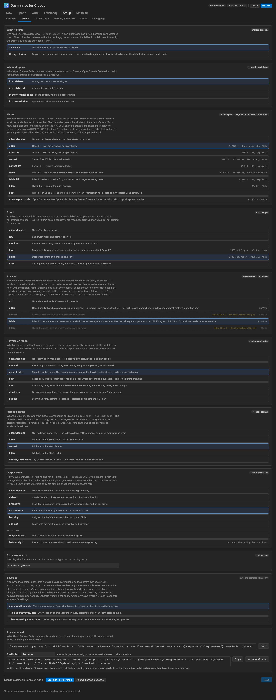
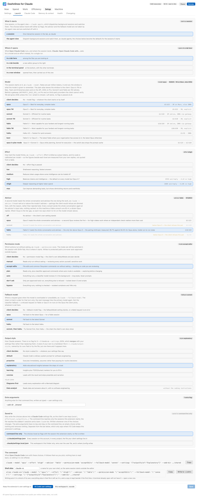
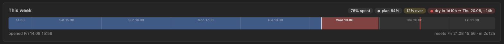
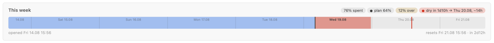
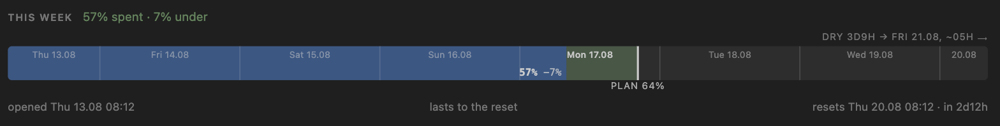
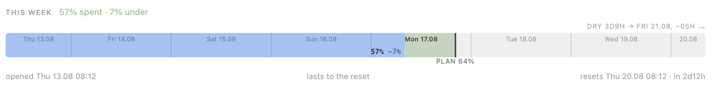
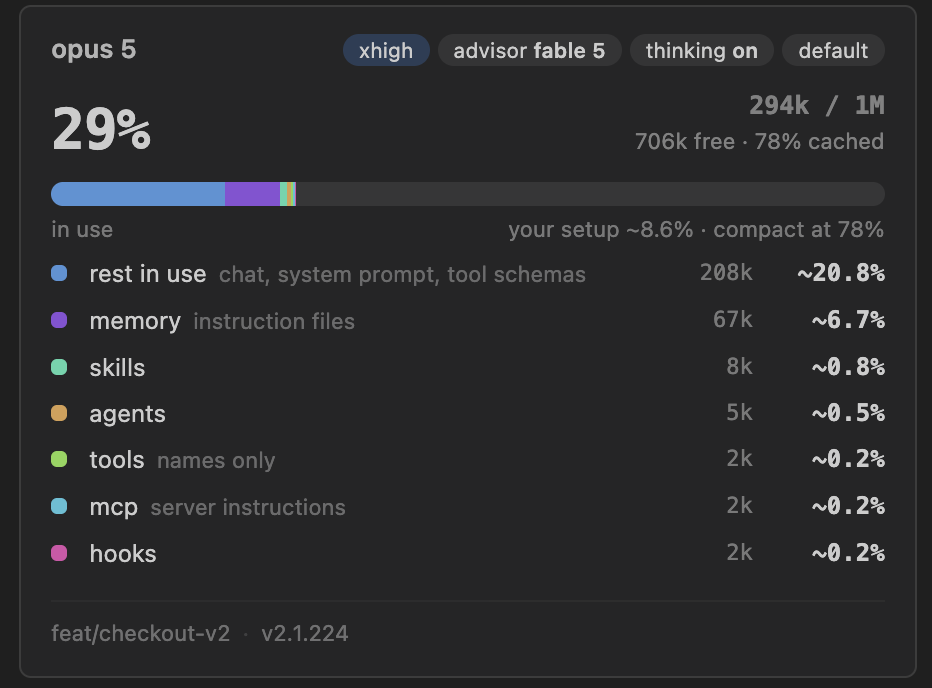
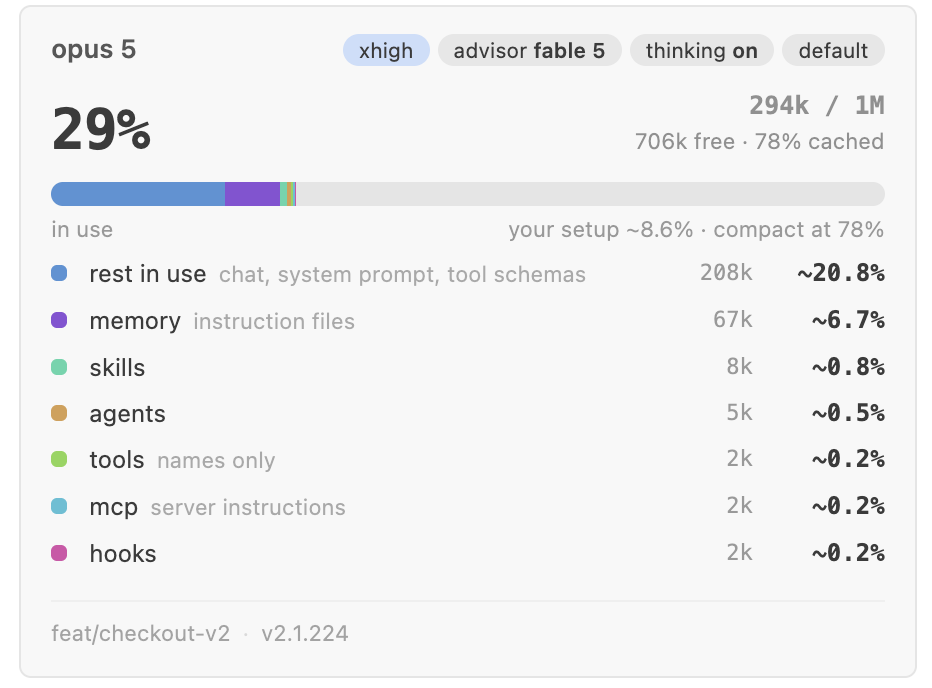

<p align="center">
  
</p>

<h1 align="center">Dashnlines for Claude</h1>

<p align="center">
  <b>Two things in one extension.</b><br/>
  A <b>dashboard</b> over every Claude Code transcript on the machine — spend, agents, workflows, limits, friction —<br/>
  and a <b>status bar</b> you write yourself, for the four numbers you want in front of you all day.
</p>

<p align="center">
  <a href="https://marketplace.visualstudio.com/items?itemName=grgrwlkr.claude-dashboard"></a>
  <!-- installs and rating wait for real data: with no statistics yet the badge
       services do not go blank, they print the upstream error code as the value
       — "installs 500" reads as five hundred installs. Paste back once the first
       ones land:
  <a href="https://marketplace.visualstudio.com/items?itemName=grgrwlkr.claude-dashboard"></a>
  <a href="https://marketplace.visualstudio.com/items?itemName=grgrwlkr.claude-dashboard&ssr=false#review-details"></a>
  -->
  <a href="https://open-vsx.org/extension/grgrwlkr/claude-dashboard"></a>
  <a href="https://github.com/grgrwlkr/claude-dashboard-vscode"></a>
  <a href="LICENSE"></a>
</p>

<p align="center">
  <a href="#user-content-what-you-get"><b>Features</b></a> ·
  <a href="#user-content-dark-and-light"><b>Screenshots</b></a> ·
  <a href="#user-content-install"><b>Install</b></a> ·
  <a href="#user-content-configuring-the-bar"><b>Configure the bar</b></a> ·
  <a href="#user-content-the-dashboard"><b>Dashboard</b></a> ·
  <a href="#user-content-workflow-runs"><b>Workflows</b></a> ·
  <a href="#user-content-in-the-terminal"><b>Terminal</b></a>
  <br/>
  <a href="#user-content-privacy"><b>Privacy</b></a> ·
  <a href="#user-content-settings-and-commands"><b>Settings</b></a> ·
  <a href="#user-content-where-the-data-comes-from"><b>Data sources</b></a> ·
  <a href="#user-content-known-issues-and-limits"><b>Known issues</b></a> ·
  <a href="#user-content-contributing"><b>Contributing</b></a> ·
  <a href="https://github.com/grgrwlkr/claude-dashboard-vscode/issues"><b>Report a bug</b></a>
</p>

> ⚠️ **Unofficial.** Not affiliated with, endorsed by or sponsored by Anthropic, PBC.
> "Claude" and "Claude Code" are their trademarks; this extension only reads what
> the tool already leaves on your own disk.

```text
✻ 7d 27% ██░░░░ dry 12.08 ~13h    ▤ 29% 294k/1M    ~$114.29 $5.18/h    ⧉ 2 ▸ 3/6
```

This extension reads Claude Code's own state on this machine — the transcripts,
sessions and settings under `~/.claude`, plus the OAuth usage endpoint — and
renders it as a status bar you write yourself and a dashboard of 24 tabs over
every transcript on the machine. The same figures are available outside the
editor: a Claude Code plugin carries the dashboard and a status line for the
terminal.

VS Code's Claude Code panel runs no status line: the `statusLine` command in
`~/.claude/settings.json` is never executed, and the requests for parity with
the CLI are closed as stale
([#55643](https://github.com/anthropics/claude-code/issues/55643),
[#21265](https://github.com/anthropics/claude-code/issues/21265)). Subagent and
workflow-run spend appears in no other view.


<a name="what-you-get"></a><a name="user-content-what-you-get"></a>

## ✨ What you get

|  |  |
| --- | --- |
| **📉 Limits and pace** | The weekly and 5-hour windows with a pace bar: `█` is spend, `▓` is spend ahead of an even burn, `▒` is plan you have not reached yet. `dry` says when you hit 100 % if the pace holds, and stays quiet when that lands after the reset. |
| **🧠 Context of the tab you are in** | How full the model's window is for the session in the terminal tab you are looking at; switching tabs switches the bar. Hover for model, effort, thinking, advisor, cache share, auto-compact distance, branch and client version. |
| **💸 Spend** | Session spend with a burn rate, today across every project, and a dashboard that breaks it down by day, model, project, branch, tool and skill. Estimated from public rates; usage credits are real money and are labelled as such. |
| **🤖 Subagents and workflows** | Subagents and workflow agents write their own transcripts. Each gets a tree, a table and a live row. |
| **🎛️ A bar you write yourself** | 45 placeholders, optional groups that vanish when empty, 11 ready-made bars, and an editor with a live preview. |
| **⌨️ Outside the editor** | A Claude Code plugin: the dashboard as a terminal command with all 24 tabs, and a status line built from the same templates. See [In the terminal](#user-content-in-the-terminal). |
| **🔒 Local by default** | Everything is read from your own disk. One request leaves the machine, the limits, and it has a switch; two further opt-ins are off until you turn them on. No telemetry. See [Privacy](#user-content-privacy). |

<a name="dark-and-light"></a><a name="user-content-dark-and-light"></a>

## 🌗 Dark and light

The page is drawn entirely from `--vscode-*` theme variables, so it follows the
editor.

| Dark Modern | Light Modern |
| --- | --- |
|  |  |
|  |  |
|  |  |
|  |  |
|  |  |
|  |  |
|  |  |
|  |  |

<a name="install"></a><a name="user-content-install"></a>

## 🚀 Install

From the [Visual Studio Marketplace](https://marketplace.visualstudio.com/items?itemName=grgrwlkr.claude-dashboard),
or from [Open VSX](https://open-vsx.org/extension/grgrwlkr/claude-dashboard) for
Cursor, Windsurf, VSCodium and Gitpod:

```bash
code --install-extension grgrwlkr.claude-dashboard
```

From source, which is also how you develop on it:

```bash
npx @vscode/vsce package
code --install-extension claude-dashboard-*.vsix
```

Then reload the window (`Cmd+Shift+P` → Reload Window). VS Code keeps the old
code in the extension host until you do.

**Nothing appeared in the status bar?** Every item hides itself when it has
nothing true to say, which happens in three cases: Claude Code has never run on
this machine (no `~/.claude`); no Claude session belongs to *this* window yet
(open the Claude Code panel and it appears within ten seconds); or limits are
switched off and no cache exists. The dashboard works either way, through
**Claude: Open dashboard**.

### Requirements

- **Claude Code** installed and used on this machine. The extension reads its
  state and asks nothing of the CLI.
- **VS Code 1.100** or newer.
- **macOS or Linux.** On Windows the extension hides items instead of printing
  wrong numbers; it is not supported there. See
  [Known issues](#user-content-known-issues-and-limits).

<a name="configuring-the-bar"></a><a name="user-content-configuring-the-bar"></a>

## 🎛️ Configuring the bar

The five items above are the default value of `claudeStatusline.segments`. One
string is one status-bar item, left to right:

```jsonc
"claudeStatusline.segments": [
  "✻ 7d {weekly}[ {drift}] {weeklyBar}[ dry {dry}]",
  "▤ {ctx} {ctxTokens}/{ctxWindow}",
  "[~{cost}][ {burn}/h]",
  "[⧉ {peers}][ ▸ {todo}]",
  "[$(gear) {wfName}][ {wfAgents}][ {wfElapsed}][ ×{wfRuns}]"
]
```

Anything outside `{…}` is literal: the icons and separators are yours to choose,
including VS Code's own `$(flame)` codicons. Square brackets mark an **optional
group**, which disappears whole when a placeholder inside it has nothing to
say — `[ dry {dry}]` is silent for the first half hour of a window and appears
once a forecast exists. A segment whose placeholders are all empty hides itself;
a segment of pure text always shows. A backslash escapes `{`, `}`, `[` and `]`.

`{dry}` is empty when the forecast lands after the reset; `{dryAt}` names the
date either way.

**Setup → Settings** in the dashboard is an editor for exactly this: a field per
segment, a preview under each one rendered by the extension itself, buttons to
reorder and remove, and a palette of every placeholder with the value it has this
minute. Clicking one inserts it at the caret.


It opens with eleven ready-made bars, each shown with what it would say on this
machine right now: **Default**, **Default + forecast**, **Minimal**, **Pace
watcher**, **Limits, in full**, **Spend**, **Session**, **Whole machine**,
**Workflows**, **The works** and **Everything, one line**. Picking one fills the
editor; nothing is written until you press Save.

The rest of the tab is the extension's own settings: what is read, what leaves
the machine, and how the bar behaves. What a session is *launched* with lives on
the **Launch** tab beside it. Save sits at the foot of the tab: inert until
something is edited, lit and marked **unsaved changes** once it is, inert again
if the edit is undone by hand. Both tabs are one form, and a change on either
lights both Save buttons.

<details>
<summary><b>All 45 placeholders</b></summary>

| Group | Placeholders |
| --- | --- |
| Limits | `{weekly}` `{weeklyBar}` `{plan}` `{drift}` `{dry}` `{dryAt}` `{dryLeft}` `{reset}` `{resetLeft}` `{session5h}` `{session5hLeft}` `{scoped}` `{scoped:Opus}` |
| Session | `{ctx}` `{ctxTokens}` `{ctxWindow}` `{ctxCache}` `{compact}` `{model}` `{effort}` `{advisor}` `{thinking}` `{outputStyle}` `{branch}` `{version}` `{update}` |
| Spend | `{cost}` `{burn}` `{today}` `{requests}` `{duration}` `{apiShare}` `{added}` `{removed}` |
| Work | `{peers}` `{peersBusy}` `{todo}` `{todoActive}` `{jobs}` `{sessions}` `{openTasks}` |
| Workflow | `{wfName}` `{wfAgents}` `{wfElapsed}` `{wfCost}` `{wfRuns}` |

A few worked examples:

```jsonc
// One dense item instead of four
["✻{weekly} ▤{ctx} ~{cost}[ ⧉{peers}]"]

// Pace and per-model windows, which the default bar leaves to the tooltip
["7d {weekly} ({drift})[ · opus {scoped:Opus}]", "resets {resetLeft}"]

// Machine-wide rather than session-scoped
["$(server) {sessions}[ · {jobs} running][ · {openTasks} open]", "today ~{today}"]
```

Outside the dashboard, **Dashnlines for Claude: List status-bar placeholders** shows
the same list in a quick pick and copies whichever you choose.

</details>

Tooltips are not configurable. Each segment gets the full tooltip of every topic
it mentions, so a number hidden from the bar is still on the hover. A segment
carrying a limit or a context fill takes the editor's warning background past
50 % and its error background past 80 % — amber and red in the stock themes.
A field no segment mentions is never collected: a bar without `{today}` does not
walk every project.

### The week as a track

The Now tab draws the pace answer instead of stating it:


The rail carries no text; what each mark means is in the pills beside the
heading. The **blue** length is the week as it has been spent, day by day. The
**rule in the theme's own text colour** — white on a dark theme, black on a light
one — is where an even burn would stand right now, and the pill `plan 64%` wears
a dot of that colour. The **red block** past the rule is the overspend, stated by
the pill `12% over`. The **red line** further along is the forecast, and its pill
carries a red dot and the whole statement: `dry in 1d10h → Thu 20.08, ~14h`. The
gap between that line and the end of the track is time without quota, measured
against the `resets … · in 2d12h` in the footer.

That rule is the only mark that changes colour between themes; the others are
chart colours — blue for spent, red for the overspend and the forecast, green
for the slack when a week runs under its plan.

The same week spent under its plan is the other half of the vocabulary:


Every red mark is gone, and two things take their place. The **green block**
between the spent length and the plan rule is the slack, seven points of the week
still in hand, stated by the pill `7% under`. The forecast pill loses its dot:
`dry Sat 22.08, ~13h, after the reset` names the day the quota would empty, and
the rail carries no mark for it — the window resets on Friday, this rate empties
it on Saturday. This is the case where `{dry}` is empty in the status bar and
`{dryAt}` still names the date.

### What fills the context window

The session section breaks the context window into what is in it. How the session
is set up — effort, advisor, thinking, output style — sits beside the model's
name as state. Under it: the window as one figure with the absolute numbers, a
colour bar of everything in use, and that bar's legend — one line per part,
biggest share first, each in the colour it has in the bar. The same block appears
on the Now tab and in the sidebar:


The client computes `/context` from figures it keeps in memory and writes none of
them to disk. The transcript does record the blocks the client adds to the
prompt: the skill listing, the deferred tool names, the agent listing and each
MCP server's instructions. Those, with the instruction files, are what these rows
weigh, at four characters to a token — hence the tildes, which are right in the
first digit.

**`rest in use` is not "messages".** The conversation, the system prompt and the
tool schemas arrive as one figure, the input the last reply was billed for, and
nothing on disk splits them. **`tools` counts names, not schemas**: the
transcript carries the names of deferred tools and never their definitions, which
puts the schemas inside `rest in use` too. The rows add up to everything in use,
unmeasurable parts included. Free space is the other end of the bar above.

On the line that introduces the legend sits **`your setup`**: what the six
measured rows come to as a share of the window, next to where auto-compact waits.
It is the cost of the skills, agents, MCP servers and instruction files that load
before you type, paid on every prompt of the session. The branch and the client
version close the panel as a footer, with a chip when a newer client is unpacked
and waiting for the next launch.

<a name="the-dashboard"></a><a name="user-content-the-dashboard"></a>

## 📊 The dashboard

Click any status-bar item, or run **Claude: Open dashboard**. Twenty-four tabs in
six sections: one for the state of Claude right now, three drawn from an index of
every transcript on the machine, one for how the installation is configured, and
one for what is happening on the machine at this moment.

Every tab has the same shape: a strip of headline figures, then one panel per
answer. Each panel runs heading with the current state as pills, the figure the
panel exists for, what that figure is made of, the facts, and a footer.

**⏱️ Now** is the state of Claude as the page was opened: four headline tiles,
the week as a track of time, then limits, session and spend as three panels at
full width, the task list as one strip under them, and a row per agent of every
workflow still running. These panels carry the same text as the status-bar
tooltips.

<details>
<summary><b>💸 Spend</b> — where the money went</summary>

| Tab | What it answers |
| --- | --- |
| Overview | spend all-time / 30d / 7d / today, daily stacked chart by model, a calendar heatmap, model breakdown — a model whose rate is not published carries a tilde and says so on hover — hour-of-day profile |
| Sessions | every transcript as a row: its own title, project, kind, entrypoint, models and effort, duration, how much of that duration was actually work, requests, tokens, spend — and above the table, the most sessions that ever ran at once |
| Projects | which repository the money went to |
| Branches | spend per git branch, accumulated across sessions |

</details>

<details>
<summary><b>🤖 Work</b> — what it was spent on</summary>

| Tab | What it answers |
| --- | --- |
| Agents & workflows | main vs subagent vs workflow spend, spend by the agent type a dispatch asked for, what one agent costs (median, p90, max output tokens), agents per workflow run, and every run on the machine — its name, how it ended, its phases and its spend, with the prompt and the answer of each of its agents one click away |
| Tools & MCP | which tools were called and how often, which of them fail, which MCP servers earn their place in the config, how many advisor consultations there were |
| Files | every file an edit or write touched, by edit count and by lines changed |
| Skills | which skill was driving when the tokens burned, from the transcript's own `attributionSkill` |
| Content | prompt counts, length histogram, where prompts came from, and the words you use |

</details>

<details>
<summary><b>⚡ Efficiency</b> — whether it was spent well</summary>

| Tab | What it answers |
| --- | --- |
| Models & effort | spend as a model × effort matrix with an `advisor` column for consultations, which client the requests came from (`cli`, `claude-vscode`, `sdk-py`), output per request per tier |
| Cache | share served from cache, what the reads saved, reads per token written, the 1h/5m TTL split, and the replies the cache could not answer — calls that sent more than 100k of input at the full rate, largest first |
| Friction | failed tool calls, denials, compactions and the context they dropped, sessions with the most failures |
| Limits | the weekly window over time, one line per week, overlaid against the even-spend diagonal; the four newest windows are shown, older ones fade with age and open with **Show N older windows** |


</details>

<details>
<summary><b>🔧 Setup</b> — how the installation is configured</summary>

| Tab | What it answers |
| --- | --- |
| Settings | the extension's own settings — the bar, the reads it makes, where its items sit — edited here rather than in `settings.json` |
| Launch | what **Open Claude Code** starts a session with: the model, the effort, the advisor and the output style, each option carrying what it is for and what it costs — including the styles you wrote yourself, read from `~/.claude/output-styles` |
| Claude Code | what you have set, what you could set, and what you moved away from the default — settings files in the order the client resolves them, with the file that won each key named and the ones it shadowed counted |
| Memory & context | the files loaded into every prompt — `CLAUDE.md`, `rules/`, project memory — sized in tokens and priced across every request made |
| Health | settings as they resolve, MCP servers, plugins and what each ships — each marked used or idle by whether anything of it appears in the transcripts — hooks, permission rules |
| Changelog | the client's own changelog, cut at the version currently running |

Nothing in this section writes to `~/.claude`, and there is no delete button
anywhere in it.

</details>

<details>
<summary><b>🖥 Machine</b> — what is happening right now, rather than what is set up</summary>

| Tab | What it answers |
| --- | --- |
| Live now | sessions whose process is alive, editors attached, daemon workers — and registry entries left by sessions that crashed |
| Background jobs | every background agent: state, tokens burned, the session it holds, and the scratch directory it never cleaned up |
| Task lists | todo lists left behind by sessions, and what is still open in them |
| Disk | every directory under `~/.claude` by size, with the leftovers named |

</details>

**Indexing.** The first run reads every transcript — about 1.1 GB and 4–5 s on
the machine this was built on — behind a progress notification that stays up until
the page is drawn. After that a file
whose size and mtime are unchanged is reused as-is, and a refresh costs tens of
milliseconds. A line is JSON-decoded only if it carries a marker that matters.
The index lives in the extension's own storage, holds only aggregates, and never
stores prompt text.

<a name="workflow-runs"></a><a name="user-content-workflow-runs"></a>

## 🧵 Workflow runs

The `/workflows` progress tree lives in the terminal and dies with it; what it
wrote to disk stays. The extension reads that into three surfaces: a **Workflow
runs** tree in the Activity Bar (run → phase → agent), the runs table on the
dashboard, and the placeholders above.

That tree is the last of four sections in the **Dashnlines for Claude** container.
Above it: **Limits** — the week as the figure, the 5-hour and per-model windows
as rows under it, whether spend is over or under plan, and when the window runs
out at this rate; **Session** — the model, the context window with a breakdown of
what fills it, and what the session in this window has cost, hidden when there is
no session here; and **Live sessions** — every session on the machine whose
process is alive, named by its project. The first two carry the status bar's own
tooltip text. The container opens with those two sharing the height and the two
lists collapsed; VS Code remembers whatever you drag or open instead. The icon
carries a badge with the number of live sessions.

A run is in one of three states: **running** (no final snapshot, the owning
session is alive, the directory moved in the last ten minutes), **finished** (the
client wrote its one snapshot), and **abandoned** (everything else). The client
writes the snapshot once, at the end; a client that dies never writes one.

**Money comes from `usage` records only**, from the index for an agent that has
stopped and straight from the transcript for one still writing. The totals a
snapshot carries are context sizes, not spend, and are never turned into dollars;
on this machine the two are about thirty times apart.

Right-click a run to open the workflow script it was launched from, or to copy
its `runId` together with that path, which is what `resumeFromRunId` needs to
replay a stage that failed. There is deliberately no way to kill a run from here.

<a name="in-the-terminal"></a><a name="user-content-in-the-terminal"></a>

## ⌨️ In the terminal

The same figures outside the editor, as a Claude Code plugin. The repository is
its own marketplace:

```
/plugin marketplace add grgrwlkr/claude-dashboard-vscode
/plugin install dashnlines@dashnlines
```

**A dashboard with the page's six sections and all 24 tabs.** Run it in a
terminal of its own:

```bash
dashnlines
```

| key | |
| --- | --- |
| `←` `→` | the next tab, crossing into the next section |
| `Tab` `⇧Tab` | the next section |
| `1`–`9` | a tab of this section |
| `↑` `↓` `space` | scroll |
| `r` | re-read |
| `q` `Ctrl-C` | leave |

Twelve tabs are drawn from the usage index: Overview, Sessions, Projects,
Branches, Agents, Tools & MCP, Files, Skills, Content, Models & effort, Friction
and Limits. Build the index with `dashnlines --reindex`. Settings and Launch stay
in the editor; the rest say so when opened.

| flag | |
| --- | --- |
| `--print` | one frame instead of the screen, for a pipe or a screenshot |
| `--tab <id>` | which tab `--print` draws |
| `--width N` | a fixed width instead of the terminal's |
| `--no-color` | drop the ANSI escapes |
| `--session ID` | describe another session |

**`/dashnlines:dashboard`** prints the same frame inside a Claude Code session.

**A status line for the terminal**, from the same templates as the status bar.
In `~/.claude/settings.json`:

```json
"statusLine": {
  "type": "command",
  "command": "S=$(ls -d \"$HOME\"/.claude/plugins/cache/dashnlines/dashnlines/*/bin/statusline.js 2>/dev/null | sort -V | tail -1); if [ -f \"$S\" ] && command -v node >/dev/null 2>&1; then exec node \"$S\"; else exec \"$HOME/.claude/statusline.sh\"; fi"
}
```

The plugin cache carries the plugin's version in its path, so the command
resolves it at run time and falls back to your previous `statusline.sh` when no
plugin is installed.

Segments are passed as arguments; `NO_COLOR` and `--no-color` drop the escapes.
The client hands it the context window, both rate limits and the session's cost
on stdin, so it opens no file and reads no credential.

<a name="privacy"></a><a name="user-content-privacy"></a>

## 🔒 Privacy

Everything on the dashboard and in the bar is read from your own disk. **One
request can leave the machine, and it is optional.**

| | |
| --- | --- |
| **What is read locally** | `~/.claude` — transcripts, the session registry, settings, plugins, workflow runs. Read-only: nothing of ours is ever written there. |
| **What is written** | Only inside the extension's own storage: the aggregate index and the limit history. Neither holds prompt text. |
| **What leaves the machine** | One `GET https://api.anthropic.com/api/oauth/usage`, the same endpoint Claude Code's own `/usage` screen reads, carrying the OAuth token Claude Code already stores. At most once a minute per machine, however many windows are open, and shared with a terminal `statusline.sh` through the same cache file if you run one. |
| **What happens to the token** | Read from the macOS Keychain (`Claude Code-credentials`), or from `~/.claude/.credentials.json` when the Keychain has nothing, and put into one `Authorization` header. Never logged, never cached, never written, never sent anywhere else. |
| **Two things that could, and do not** | `claudeStatusline.checkPluginUpdates` asks each plugin's marketplace whether a newer version exists; `claudeStatusline.fetchChangelog` refreshes Anthropic's own published documentation and changelog — public files, no credentials, at most once an hour, cached in the extension's storage. **Both are off by default**, and off means those requests are never made: the settings reference then comes from the copy packaged with the extension, which says how old it is. |
| **Credentials are hidden even from you** | Anything in the settings whose name looks like a key, token, secret or password renders as `•••`, at any depth inside an object. A plain number stays readable, such as `MAX_THINKING_TOKENS`. A test plants a token in the settings and asserts it never reaches the rendered page. |
| **Telemetry** | None. No analytics, no crash reporting, no phoning home. |
| **How to switch it all off** | `"claudeStatusline.fetchLimits": false`. Off means the token is not read at all, and with the two opt-ins above left alone the extension then makes no network request whatsoever. |

The **Content** tab never stores prompt text, only counts, a length histogram and
word tallies, computed and discarded in the same pass.

<a name="settings-and-commands"></a><a name="user-content-settings-and-commands"></a>

## ⚙️ Settings and commands

All of these apply the moment they change; none needs a window reload.

| Key | Default | Meaning |
| --- | --- | --- |
| `claudeStatusline.segments` | five templates | One status-bar item per string; see [Configuring the bar](#user-content-configuring-the-bar) |
| `claudeStatusline.fetchLimits` | `true` | Ask Anthropic for the account's limits; `false` keeps the token unread and the network untouched |
| `claudeStatusline.autoRefresh` | `true` | Redraw on a timer. Off, the cheap ten-second read still runs and the expensive pass happens only on **Reindex** or **Refresh now**, which is useful on battery and for reading a list without the page rebuilding under you. Pause it from the page header or from the Settings tab; both move the same switch |
| `claudeStatusline.fetchChangelog` | `false` | Refresh Anthropic's published changelog and settings reference. Off means those requests are never made and the packaged copy is used, dated |
| `claudeStatusline.monthlyBudget` | `0` | A spend ceiling for the calendar month, in dollars. Above zero the dashboard draws the month against it and says so once at 80 % and once at 100 % |
| `claudeStatusline.checkPluginUpdates` | `false` | Ask each plugin's marketplace for a newer version. Off means those requests are never made |
| `claudeStatusline.openLocation` | `activeGroup` | Where **Open Claude Code** puts the session: `activeGroup` a tab in the group you are looking at, `beside` a tab in a new group to the right, `panel` the terminal panel at the bottom, `newWindow` a tab moved out into its own window |
| `claudeStatusline.model` | `""` | Start the session on this model, as `claude --model <alias>`, from the aliases the client accepts: `opus`, `opus[1m]`, `sonnet`, `sonnet[1m]`, `fable`, `fable[1m]`, `haiku`, `best`, `opusplan`. The `[1m]` variants ask for the 1M window explicitly; the plain alias runs on 200k behind a gateway, on Pro and on third-party providers. Empty passes no flag and leaves the choice to the client |
| `claudeStatusline.effort` | `""` | Start it at this effort, as `claude --effort <level>`: `low`, `medium`, `high`, `xhigh`, `max`. Empty passes no flag |
| `claudeStatusline.advisor` | `""` | Turn on the server-side advisor for the session, as `claude --advisor <model>`: `opus`, `sonnet`, `fable`, `haiku`. The client hides this flag from its `--help`; empty passes no flag and leaves the client's own `advisorModel` alone |
| `claudeStatusline.outputStyle` | `""` | Ask for an output style for the session: `default`, `Proactive`, `Explanatory`, `Learning`, `Concise`. There is no flag for it, so it travels as `--settings '{"outputStyle":"…"}'`, which merges with your settings files rather than replacing them. A style of your own is a markdown file in `~/.claude/output-styles`; the **Setup → Launch** tab lists what is there and writes the name here for you |
| `claudeStatusline.permissionMode` | `""` | Start the session in this permission mode, as `claude --permission-mode <mode>`: `default`, `acceptEdits`, `plan`, `auto`, `dontAsk`, `bypassPermissions`. Shift+Tab still switches it in the session. Empty passes no flag. User settings only |
| `claudeStatusline.fallbackModel` | `""` | Where a request goes when the model is overloaded or unavailable, as `claude --fallback-model <chain>`: `opus`, `sonnet`, `haiku`, `sonnet,haiku`. Tried in order, for that turn only. Empty passes no flag. User settings only |
| `claudeStatusline.aliasName` | `""` | A name for the same session started from a terminal. The **Setup → Launch** tab writes out `alias <name>='claude …'` carrying every choice above it, copies it on a click, and can write it into `~/.zshrc` on the **Write to ~/.zshrc** button. A name is what a shell accepts for one, or no line is offered. User settings only |
| `claudeStatusline.launchArgs` | `""` | Anything else for the command line, after those: `--permission-mode acceptEdits`, an exact model id. Written as typed, so quoting is yours. User settings only, so a project cannot set it through `.vscode/settings.json` |
| `claudeStatusline.renameTabs` | `true` | Name each terminal opened by **Open Claude Code** after the session running in it, following `/rename` and the generated title. Only terminals this extension opened, and only while one of them is the active terminal — VS Code's rename acts on the active terminal |
| `claudeStatusline.refreshInterval` | `60` | Refresh period for limits and session stats, seconds |
| `claudeStatusline.alignment` | `right` | Which side of the status bar |
| `claudeStatusline.priority` | `100` | Position within that side |

**Commands:** Claude: Open dashboard · Open Claude Code · Open Claude Code with…
· Rebuild the usage index · Export usage as CSV or JSON · Refresh now · List
status-bar placeholders · Remove the shell alias · and, from a row of the
workflow view, Open the workflow script and Copy the workflow run id.

### Open Claude Code

A button in the editor's title bar, next to Claude Code's own, and a second one
in the status bar. Both start a terminal session; they differ in where it lands.
Claude Code's button splits a new editor group off to the right. This one goes
where `claudeStatusline.openLocation` says — by default a tab in the group you
are looking at — and runs `claude` from the shell's `PATH`. The setting is read
when you press the button, and the hover names the place it will use. Right-click
the title bar to hide either button.

The status-bar copy sits left of every segment, on whichever side
`claudeStatusline.alignment` puts them, as `$(terminal)$(sparkle)` — the status
bar takes codicons and nothing else. It is drawn before anything has been read,
on a machine that has never run Claude Code included. Right-click the status bar
and untick **Dashnlines for Claude: Open** to put it away; the segments are listed
there as **Dashnlines for Claude 1**, **2**, and so on.

**The session can be started on settings of your own**: the model, how hard it
thinks, whether a second model advises it, which actions run without asking,
where a request goes when the model is overloaded, and how it answers you. That
is the **Setup → Launch** tab, one panel per choice, each option carrying what it
is for and what it costs:


Each choice becomes one flag on the command line the button runs, and each one
left alone passes no flag, so the client decides exactly as it did before. A
fully configured button runs:

```bash
claude --model 'opus' --effort 'max' --advisor 'fable' --settings '{"outputStyle":"Explanatory"}' --permission-mode acceptEdits
```

The extension quotes its own flags on the way in; the extra arguments are
appended as typed, so a bracketed value there is written quoted, as
`--model 'opus[1m]'` — unquoted, zsh reads it as a pattern and answers
`no matches found` without running anything.

The tab writes that line out under the choices with a button that copies it, and
under it the same command as a shell alias, named in
`claudeStatusline.aliasName`. The alias is quoted a second time, so its inner
quotes do not close the outer ones.

**Write to ~/.zshrc** puts the alias in the file, inside a block the extension
owns; the rest of the file comes back byte for byte. The first write keeps a copy
beside it and the replace is atomic. It happens on that button only, never on
Save. The button only ever writes; **Claude: Remove the shell alias** is what
takes the block out again. A shell whose `alias` takes different syntax is told
so instead of being handed a line.
**Claude: Open Claude Code with…** asks for a model and an effort instead of
reading the settings, for the one run that is not like the others.

A session opened this way survives a window reload: VS Code reconnects the tab to
a shell that never stopped, and the tab keeps following the session's name. After
a full quit there is no process to reconnect to, and the tab comes back with its
scrollback and no `claude` in it. Nothing survives with
`terminal.integrated.enablePersistentSessions` off, which is VS Code's own switch
for all of this.

<a name="where-the-data-comes-from"></a><a name="user-content-where-the-data-comes-from"></a>

## 🧭 Where the data comes from

Nothing is asked of the CLI; it has no channel to ask.

- **Limits** — `api.anthropic.com/api/oauth/usage`, the endpoint the `/usage`
  screen reads. The extension makes that request itself and caches the answer in
  `~/.claude/statusline-usage.json`, at most once a minute per machine however
  many windows are open. Nothing else has to be installed; the cache and its
  stamp use the same file a terminal `statusline.sh` would, so if you run one too
  the two share a single request rather than making two. Data older than 30
  minutes is not drawn.
- **The window's session** — `~/.claude/sessions/*.json`. Which of them the bar
  describes is decided in order: the terminal tab you are looking at, matched by
  `ppid(claude) === pid(shell)`; then the Claude Code panel, a direct child of
  the extension host, matched by `ppid(pid) === process.pid`; then the most
  recent session in this workspace. A tab with no Claude in it falls back to that
  last answer.
- **Context and statistics** — `~/.claude/projects/<slug>/<sessionId>.jsonl`.
  Context is read from a 256 KB tail in about 2 ms; the full pass for cost,
  duration and edits takes about 20 ms and runs on the minute tick.
- **Workflow runs** — the run's snapshot once it has ended, and while it has not,
  the roll-call journal the runtime keeps for `resumeFromRunId` plus the agents'
  transcripts as they grow. All of it is undocumented internal state: every field
  is optional, and a read that fails hides a row instead of filling it in.
- **Spend** — computed from public per-million-token rates in `pricing.js`. It is
  an estimate, not a bill: the real figure depends on plan and discounts. An
  unrecognised model is priced at Opus rates and flagged as such.
- **Limit history** — nowhere: the usage endpoint answers only for the present
  moment. The extension appends a row to its own storage whenever a percentage
  moves, plus a heartbeat every six hours, and keeps 52 weeks of rows.

<a name="known-issues-and-limits"></a><a name="user-content-known-issues-and-limits"></a>

## ⚠️ Known issues and limits

| | |
| --- | --- |
| **Windows is not supported** | The OAuth token lives behind the macOS Keychain or in `~/.claude/.credentials.json`, and session ownership is resolved with POSIX `ps`. On Windows the extension degrades quietly, items staying hidden instead of printing wrong numbers. macOS and Linux are the supported pair; a Windows port is welcome as a PR. |
| **Remote SSH, containers, WSL** | The extension runs wherever the extension host runs, and reads the `~/.claude` of *that* machine. If Claude Code runs on the remote and you open the folder over Remote SSH, that is exactly right; if Claude Code runs locally while the window is attached to a container, the extension looks at the container's empty home and shows nothing. *(Expected from how VS Code splits extension hosts, not something we have tested on every combination.)* |
| **vscode.dev / github.dev** | Does not work at all: there is no filesystem and no process table to read. |
| **The formats are private** | Transcripts and the session registry belong to Claude Code and are not a published contract. A release that changes them turns the affected item into a dash rather than a wrong number, which does mean a number can go quiet until the reader is updated. |
| **Spend is an estimate, not a bill** | Computed from public per-million-token rates; the real figure depends on plan and discounts. Every estimated figure carries a `~`. The one exception is usage credits, which are read as billed money and shown without one. |
| **Limits can go quiet** | They come from the account endpoint with the token Claude Code stores. If a request fails — network, an expired token, or Anthropic tightening what non-official clients may call — the limit fields empty out and everything read from local transcripts keeps working. |
| **The first index takes a moment** | It reads every transcript on the machine behind a progress notification (~1.1 GB and 4–5 s here). After that a file whose size and mtime are unchanged is reused, so refreshes cost tens of milliseconds. |
| **An empty status bar is not a bug** | Every item hides itself when it has nothing true to say; see [Install](#user-content-install) for the three ordinary reasons. |

<a name="contributing"></a><a name="user-content-contributing"></a>

## 🤝 Contributing

```bash
node --test test/*.test.js     # the whole suite, no build step, no dependencies
```

Issues and pull requests are welcome. A
[bug report](https://github.com/grgrwlkr/claude-dashboard-vscode/issues/new?template=bug_report.yml)
naming your OS, VS Code version and Claude Code version is one that can be
chased.

**Compatibility.** The transcript and session-registry formats are private to
Claude Code and are not part of any published contract. When a Claude Code
release changes them, the affected item degrades to a dash rather than showing a
wrong number.

## 📄 Licence

[MIT](LICENSE) © Grigory Agapov
